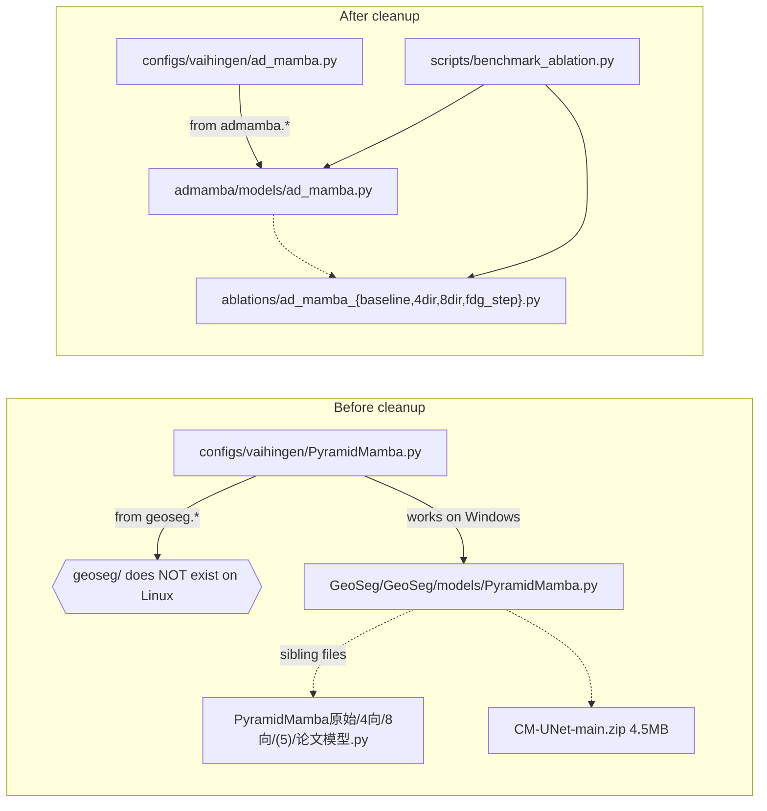

## 目标布局

整理后 `D:\Codes\ADMamba\` 直接作为仓库根，结构如下：

```text
ADMamba/
├── README.md                 # 重写：AD_Mamba 主题
├── LICENSE
├── requirements.txt          # 补全 mamba-ssm / causal-conv1d
├── .gitignore                # 新增
├── admamba/                  # 主代码包（原 GeoSeg/GeoSeg/）
│   ├── __init__.py
│   ├── models/
│   │   ├── __init__.py
│   │   ├── ad_mamba.py       # 原 PyramidMamba.py，主类改名 ADMamba
│   │   ├── unetformer.py     # 对比方法（小写）
│   │   ├── dcswin.py
│   │   ├── ftunetformer.py
│   │   ├── banet.py
│   │   ├── manet.py
│   │   ├── abcnet.py
│   │   └── a2fpn.py
│   ├── datasets/             # 同名小写化即可
│   └── losses/
├── ablations/                # 消融变体（保留可复现性）
│   ├── ad_mamba_baseline.py  # 原 PyramidMamba原始.py
│   ├── ad_mamba_4dir.py      # 原 PyramidMamba（4向）.py
│   ├── ad_mamba_8dir.py      # 原 PyramidMamba（8向）.py
│   └── ad_mamba_fdg_step.py  # 原 PyramidMamba(5).py
├── configs/                  # 原 config/ 改复数 + 内部 import 修
│   ├── vaihingen/
│   │   ├── ad_mamba.py       # 原 PyramidMamba.py（主配置）
│   │   ├── ad_mamba_topk1.py # 三组 topk 训练配置
│   │   ├── ad_mamba_topk2.py
│   │   ├── ad_mamba_topk3.py
│   │   ├── unetformer.py
│   │   ├── dcswin.py
│   │   └── ftunetformer.py
│   ├── potsdam/  └── uavid/  └── loveda/
├── tools/
│   ├── cfg.py / metric.py / utils.py
│   ├── vaihingen_patch_split.py / vaihingen_dsm_split.py
│   ├── potsdam_patch_split.py / uavid_patch_split.py
│   └── loveda_mask_convert.py
├── scripts/                  # 入口脚本统一放这里
│   ├── train.py              # 原 train_supervision.py
│   ├── test_vaihingen.py     # 原 vaihingen_test.py
│   ├── test_potsdam.py / test_loveda.py / test_uavid.py
│   ├── inference_uavid.py / inference_huge_image.py
│   ├── benchmark_model.py
│   └── benchmark_ablation.py
├── analysis/                 # 论文分析/出图脚本
│   ├── analyze_cosine_similarity.py
│   ├── analyze_direction_activation.py
│   ├── analyze_expert_direction.py
│   ├── plot_cosine_bar.py
│   └── plot_final_figures.py # 只保留最新版 v3
├── docs/
│   ├── BENCHMARK_USAGE.md
│   ├── MAMBA_SCAN_IMPROVEMENTS.md
│   └── benchmark_comparison.md
└── assets/                   # 论文图（不含训练日志/结果）
    ├── vai.png
    └── pot.png
```

注：`data/` `output/` `outputs/` `lightning_logs/` `__pycache__/` 全删，由 `.gitignore` 兜底。

## 关键决策（已采用默认值，未采用可继续讨论）

- **包名**：`admamba/`（小写），同时修复 `from geoseg.* `→ `from admamba.*`，解决 Linux 大小写问题
- **主类名**：`PyramidMamba` → `ADMamba`，并在 `admamba/models/__init__.py` 暴露 `from .ad_mamba import ADMamba`；内部子模块名保持不变以兼容旧 checkpoint 的 state_dict
- **消融变体**：保留 `benchmark_ablation.py` 用到的 4 个变体（baseline/4dir/8dir/fdg_step）并英文重命名，丢弃被弃用的"论文模型"分支
- **入口脚本**：四个数据集 test 脚本各自独立保留（与上游一致）；都移到 `scripts/`

## 主要变更明细

### 1. 删除（确认无用 / 二进制 / 占位）

- `GeoSeg/GeoSeg/models/CM-UNet-main.zip`（4.5 MB 第三方 zip）
- `GeoSeg/GeoSeg/models/PyramidMamba论文模型.py` 及其 `__pycache__` 中的 `.pyc`（被弃用的实验分支）
- `GeoSeg/train_supervision论文模型.py`、`GeoSeg/train_supervision1.py`（与 `train_supervision.py` 重复，前者带额外 ContextSSM 分支已不用）
- `GeoSeg/tools/rename_dsm_patches.py`（0 字节）
- `GeoSeg/config/vaihingen/PyramidMamba_topk3_test.pysed`（0 字节，`sed` 失败产物）
- `GeoSeg/config/vaihingen/PyramidMamba1.py`（与 `PyramidMamba.py` 几乎一致的旧版）
- `GeoSeg/config/vaihingen/PyramidMamba_test_fdgo8.py` 和 3 个 `_topk{1,2,3}_test.py`（从 README 看是 `sed` 临时生成的测试 config，可由训练 config 一行 override 替代，参见下面 §6 README 改写）
- `GeoSeg/cosine_similarity_bar.pdf`、`GeoSeg/cosine_similarity_bar.png`（论文产物，单独的 release 资产，不入仓）
- `GeoSeg/plot_final_figures.py`、`plot_final_figures_v2.py`（保留 v3 即可）
- 所有 `__pycache__/`（含孤儿 `PyramidMamba无参卷积.cpython-310.pyc`）
- `GeoSeg/.git/`（远程仍指向上游 WangLibo1995/GeoSeg；删除后由用户 `git init` 新建）
- `GeoSeg/data/`、`GeoSeg/output/`、`GeoSeg/outputs/`、`GeoSeg/lightning_logs/`（皆为空占位）

### 2. 重命名（mojibake 中文 → 英文）

- 模型变体（移到 `ablations/`）：
  - `PyramidMamba原始.py` → `ablations/ad_mamba_baseline.py`
  - `PyramidMamba（4向）.py` → `ablations/ad_mamba_4dir.py`
  - `PyramidMamba（8向）.py` → `ablations/ad_mamba_8dir.py`
  - `PyramidMamba(5).py` → `ablations/ad_mamba_fdg_step.py`
- 模型主文件：`models/PyramidMamba.py` → `admamba/models/ad_mamba.py`，类 `PyramidMamba` → `ADMamba`
- 配置文件：每个数据集下 `PyramidMamba.py` → `ad_mamba.py`，`PyramidMamba_topk{1,2,3}.py` → `ad_mamba_topk{1,2,3}.py`
- 入口脚本：`train_supervision.py` → `scripts/train.py`，`{ds}_test.py` → `scripts/test_{ds}.py`

### 3. import 路径全局替换（最关键）

在所有 `.py` 中：

- `from geoseg.` / `from GeoSeg.` → `from admamba.`
- `from geoseg.models.PyramidMamba import PyramidMamba` → `from admamba.models.ad_mamba import ADMamba`
- `tools.cfg`、`tools.utils`、`tools.metric` 保持不变（因为 `tools/` 仍在仓库根）
- `benchmark_ablation.py` 里对 4 个变体的 import 改为 `from ablations.ad_mamba_{...} import ADMamba as ADMamba_{...}`

具体清单（来自子代理审计）：
- 受影响的 config 文件：约 12 个（4 个数据集下的 `*PyramidMamba*.py`）
- 受影响的脚本：`train_supervision.py`、`benchmark_model.py`、`benchmark_ablation.py`、`vaihingen_test.py` 等 4 个 test 脚本、`inference_*.py`、3 个 `analyze_*.py`、`plot_final_figures_v3.py`

### 4. 配置文件清洗

每份 config 里：

- 移除硬编码 `/root/autodl-tmp/...` 路径，改为相对路径或环境变量（如 `dataset_root = os.environ.get('ADMAMBA_DATA', './data/vaihingen')`）
- 删去 `vaihingen/` 下 4 份 `_test.py` 形态的 config（它们等价于把训练 config 里 `test_weights_name` 改一行；改在 README 给一句 CLI 替代）

### 5. 分析脚本清洗

`analysis/analyze_*.py` 中替换 `/root/autodl-tmp/GeoSeg` → `Path(__file__).resolve().parent.parent`，并 import 路径改 `admamba.*`

### 6. 新增 / 重写文件

- `requirements.txt` 追加：

```text
mamba-ssm>=1.2.0
causal-conv1d>=1.4.0
thop          # 用于 benchmark FLOPs
```

- `.gitignore`（标准 Python + 训练产物）：

```gitignore
__pycache__/
*.pyc
*.pdf
*.zip
data/
output/
outputs/
lightning_logs/
model_weights/
fig_results/
*.ckpt
.idea/
.vscode/
```

- `admamba/__init__.py`、`admamba/models/__init__.py`、`admamba/datasets/__init__.py` 暴露公开 API：

```python
# admamba/models/__init__.py
from .ad_mamba import ADMamba, EfficientADMamba
```

- `README.md` 全部重写，结构：项目简介 → AD_Mamba 创新点（8 向斜扫描 / Sparse-MoE / Fractional Difference Gate / GeoMSAA）→ 安装 → 数据准备 → 训练命令 → 测试命令 → 消融实验复现 → 引用。命令统一改成新路径：

```bash
python scripts/train.py -c configs/vaihingen/ad_mamba.py
python scripts/test_vaihingen.py -c configs/vaihingen/ad_mamba.py -o output/vaihingen/ad_mamba -t d4 --rgb
```

### 7. PyramidMamba.py 内部代码层面（最小侵入）

只做必要修改，不动算法：

- 顶层类 `PyramidMamba` → `ADMamba`，`EfficientPyramidMamba` → `EfficientADMamba`
- 删 4 个未引用的 `ConvBN/SeparableConvBN/SeparableConvBNReLU/SeparableConv` 工具类（约 30 行死代码，子代理已确认）
- 把 `from mamba_ssm import Mamba` 包成 `try/except` 给出友好报错（CPU 环境装不了 mamba-ssm 时清晰提示）
- 中文 `#YTY修改X` / `#wth修改X` 历史日记式注释保留但简化（不影响功能，作者署名信息）

注：MoE 路径下 fractional/elevation gate 被绕过的 bug、`HardTopKRouting` 反传 STE 不完整等问题**不在本次清理范围**，作为 issue 记录到 README 的 Known Issues。

## 验收标准

- 在 Linux 干净环境 `git clone` 后，`pip install -r requirements.txt` + 按 README 准备 `data/vaihingen/`，能跑通：
  - `python scripts/train.py -c configs/vaihingen/ad_mamba.py`
  - `python scripts/test_vaihingen.py -c configs/vaihingen/ad_mamba.py -o output/test -t d4 --rgb`
- `python -c "from admamba.models import ADMamba; ADMamba(num_classes=6)"` 不报 import / 大小写错
- 仓库根 `Get-ChildItem -Recurse | Measure-Object -Property Length -Sum` 不超过 ~5 MB（去掉 zip / pdf / png / .git / pyc 后）
- 没有任何 mojibake 中文文件名残留（`Get-ChildItem -Recurse -Name | Select-String '[^\x00-\x7f]'` 为空）

## 数据流图（清理前 vs 清理后）



## 实施顺序（执行阶段，本计划暂不执行）

1. **备份**：执行前先 `git init` 一次到 `D:\Codes\ADMamba\.bak\` 之外的位置，或建议用户先 commit 现状到一个备份分支
2. 删除 zip/pdf/png/.git/pycache/空目录
3. 重命名 mojibake 文件，并 `git mv`-style 整理目录
4. 跨文件 import / 类名替换（用 StrReplace 批量）
5. 改写 `requirements.txt`、新增 `.gitignore`、重写 `README.md`
6. 跑一遍语法检查（`python -m compileall admamba/ ablations/ scripts/ tools/ analysis/ configs/`）确认无 import / 语法错