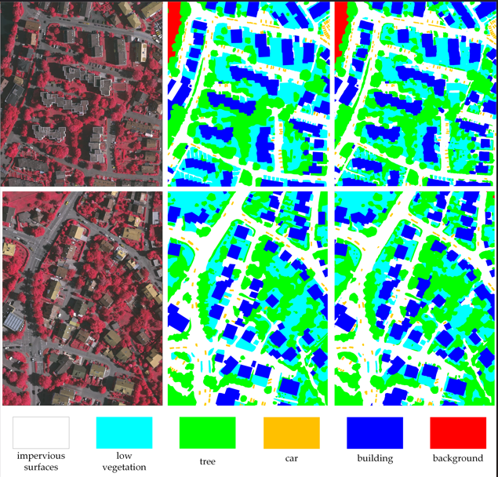
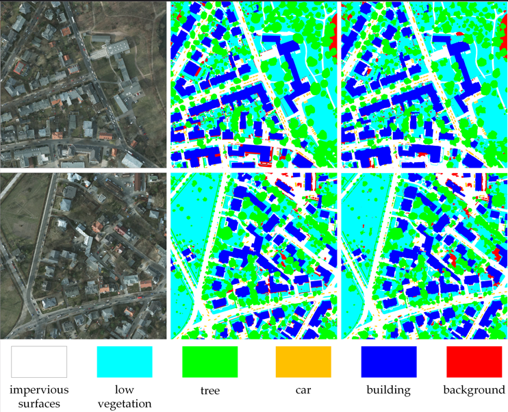

# AD-Mamba

**简体中文：** [README_zh.md](README_zh.md)

AD-Mamba (Anti-Dilution Mamba) is a remote-sensing semantic
segmentation framework that extends [PyramidMamba](https://arxiv.org/abs/2406.10828)
with three ideas tailored to overhead imagery:

- **8-direction diagonal scanning.** A custom `CrossScan` / `CrossMerge`
  autograd pair feeds the Mamba state-space model with horizontal, vertical,
  diagonal, and anti-diagonal sequences (and their reverses).
- **Sparse top-k MoE direction routing.** A learnable gate selects the most
  informative scan directions per sample, with a load-balancing auxiliary
  loss inspired by MoCE-IR.
- **Fractional-order difference gate (FDG).** A Grünwald-Letnikov fractional
  derivative gate (with optional DSM/nDSM fusion) replaces the original
  first-order difference gate to capture long-range dependencies along each
  scan direction.

Validated datasets: **ISPRS Vaihingen** and **ISPRS Potsdam**.

<p align="center">
  
  
</p>

The implementation is adapted from
[`WangLibo1995/GeoSeg`](https://github.com/WangLibo1995/GeoSeg) and inherits
its `pytorch_lightning` + `timm` training scaffold.

## Repository layout

```text
ADMamba/
├── admamba/                # Importable Python package
│   ├── datasets/           # Vaihingen / Potsdam loaders
│   ├── losses/             # Cross-entropy, Dice, Lovasz, ...
│   └── models/             # ad_mamba.py + reference networks
├── ablations/              # Standalone snapshots used by benchmark_ablation.py
│   ├── ad_mamba_baseline.py    # Original 1-row scan
│   ├── ad_mamba_4dir.py        # 4-direction scan
│   ├── ad_mamba_8dir.py        # 8-direction scan
│   └── ad_mamba_fdg_step.py    # 8-select-4 + 1st-order FDG (RGB only)
├── configs/                # py-config files consumed by tools/cfg.py
│   ├── vaihingen/
│   └── potsdam/
├── tools/                  # cfg / metric / data preprocessing utilities
├── scripts/                # Training, testing, inference, benchmarking
│   ├── train.py
│   ├── test_{vaihingen,potsdam}.py
│   ├── inference_huge_image.py
│   ├── benchmark_model.py
│   └── benchmark_ablation.py
├── analysis/               # Paper figures & post-hoc analyses
├── docs/                   # Long-form notes (benchmark, scan analysis)
├── assets/                 # Static figures used in the paper
├── pyproject.toml
├── requirements.txt
├── CITATION.cff
└── LICENSE
```

## Installation

> Verified combo: Ubuntu 22.04 / RTX 4090 / CUDA Toolkit 12.1 / gcc 11.4 /
> Python 3.10 / `torch==2.3.1+cu121` / `causal-conv1d==1.4.0` /
> `mamba-ssm==2.2.2` / `transformers==4.43.4`.

### 1. Create the conda env

The fully populated env weighs ~6.4 GB (PyTorch + mamba-ssm wheel +
deps). On AutoDL-style machines that ship a small system disk and a
larger data disk, you have two choices:

- **System disk** (default `conda` location, e.g. `/root/miniconda3/envs/`):
  the env is captured when you save a custom image, so it survives
  re-creating the instance and can be reused on a different machine.
  Recommended unless you really need every byte of the system disk.
- **Data disk** via `--prefix /root/autodl-tmp/envs/admamba`: keeps
  the system disk untouched but the env will not be packed into a
  saved image (data-disk contents stay on the host).

Either way, route pip's cache and the build TMPDIR to the data disk so
they don't bloat the image:

```bash
conda create -y -n admamba python=3.10
conda activate admamba

export PIP_CACHE_DIR=/root/autodl-tmp/.pip-cache
export TMPDIR=/root/autodl-tmp/tmp && mkdir -p "$PIP_CACHE_DIR" "$TMPDIR"
pip install -U pip wheel "setuptools<81" packaging ninja
```

`setuptools<81` is required because `pytorch_lightning==2.3.0` still imports
the now-deprecated `pkg_resources` namespace.

### 2. Install PyTorch (cu121)

```bash
pip install torch==2.3.1 torchvision==0.18.1 \
  --index-url https://download.pytorch.org/whl/cu121
python -c "import torch; print(torch.__version__, torch.cuda.is_available())"
# expected: 2.3.1+cu121 True
```

### 3. Install the project (editable)

```bash
cd <repo-root>
pip install -e .                                                   # core deps
pip install "transformers==4.43.4"                                 # mamba-ssm 2.2.2 needs the 4.4x API
```

A China-friendly mirror is `-i https://pypi.tuna.tsinghua.edu.cn/simple` if
PyPI is slow.

### 4. Install the CUDA kernels (`causal-conv1d`, `mamba-ssm`)

```bash
export CUDA_HOME=/usr/local/cuda-12.1
export PATH=$CUDA_HOME/bin:$PATH
export LD_LIBRARY_PATH=$CUDA_HOME/lib64:$LD_LIBRARY_PATH
export MAX_JOBS=4

# (a) causal-conv1d compiles cleanly from sdist (~9 minutes on a 4090 box):
pip install --no-build-isolation causal-conv1d==1.4.0
```

`mamba-ssm==2.2.2` ships a broken sdist (the `csrc/selective_scan/*.cpp`
sources are missing), so build-from-source fails. Use the official
prebuilt wheel from
[state-spaces/mamba releases](https://github.com/state-spaces/mamba/releases/tag/v2.2.2)
that matches your torch/CUDA/Python combo. For our verified combo the file
is `mamba_ssm-2.2.2+cu122torch2.3cxx11abiFALSE-cp310-cp310-linux_x86_64.whl`
(308 MB; cu122 wheels are forward-compatible with cu121 runtimes):

```bash
mkdir -p /root/autodl-tmp/wheels && cd /root/autodl-tmp/wheels
WHEEL=mamba_ssm-2.2.2+cu122torch2.3cxx11abiFALSE-cp310-cp310-linux_x86_64.whl
# raw GitHub is slow/blocked from many GPU-rental regions; use a fast mirror:
curl -fL --retry 3 -o "$WHEEL" \
  "https://ghfast.top/https://github.com/state-spaces/mamba/releases/download/v2.2.2/$WHEEL"
pip install --no-build-isolation "$WHEEL"
```

### 5. Verify the install

```bash
python -c "
import torch, causal_conv1d, mamba_ssm
from mamba_ssm.ops.selective_scan_interface import selective_scan_fn
print('torch', torch.__version__, 'cuda', torch.cuda.is_available())
print('mamba_ssm', mamba_ssm.__version__)
"
# expected: torch 2.3.1+cu121 cuda True / mamba_ssm 2.2.2
```

Forward smoke test (no training data needed; ~1 minute):

```bash
export HF_ENDPOINT=https://hf-mirror.com    # only needed if huggingface.co is unreachable
python scripts/benchmark_model.py -c configs/vaihingen/ad_mamba.py
# expected tail: Parameters 229.63M / FLOPs ~400 GFLOPs / FPS ~19 on a 4090
```

Two-step real-data training smoke test (uses Vaihingen 1024 patches; runs
in ~15 s, writes nothing to disk):

```bash
export ADMAMBA_DATA_VAIHINGEN=$(pwd)/data/vaihingen
export ADMAMBA_WEIGHTS_ROOT=$(pwd)/_smoke_weights
python - <<'PY'
import sys, pytorch_lightning as pl
sys.path.insert(0, ".")
from tools.cfg import py2cfg
from scripts.train import Supervision_Train
cfg = py2cfg("configs/vaihingen/ad_mamba.py")
trainer = pl.Trainer(max_steps=2, limit_val_batches=1, num_sanity_val_steps=0,
                     accelerator="gpu", devices=1, logger=False,
                     enable_checkpointing=False)
trainer.fit(Supervision_Train(cfg), cfg.train_loader, cfg.val_loader)
print("SMOKE_OK")
PY
```

Seeing `SMOKE_OK` confirms the env, Mamba kernels, dataset pipeline, loss
and backward are all wired up.

After installation the package is importable directly:

```python
from admamba.models import ADMamba

model = ADMamba(num_classes=6, use_fractional_gate=True, fractional_alpha=0.8)
```

## Setup troubleshooting and networking

Notes gathered while reproducing the environment on rented GPU hosts (slow or
blocked upstream mirrors).

### Conda activation

Some terminals start without Conda’s shell hook, so `conda activate admamba`
returns `CondaError: Run 'conda init' before 'conda activate'`.

Either initialise once (`conda init bash`, restart the shell), or load the
hook explicitly:

```bash
source /root/miniconda3/etc/profile.d/conda.sh   # adjust if Miniconda lives elsewhere
conda activate admamba
```

Equivalent shortcut:

```bash
source /root/miniconda3/bin/activate admamba
```

### pip / PyTorch wheel downloads

Large downloads (`torch`, compiler-heavy builds) may raise `BrokenPipeError`,
`ConnectTimeout`, or stall mid-transfer. Retry with longer timeouts, e.g.
`--timeout 300 --retries 5`. For pure-Python installs (`pip install -e .`),
`-i https://pypi.tuna.tsinghua.edu.cn/simple` helps when the default PyPI
mirror is slow.

### Building `causal-conv1d`

The step `Building wheel for causal-conv1d` can run for many minutes with
almost no new log lines while `nvcc`/ninja compile — this is expected.

### Keep `transformers` on the 4.4x line

After installing `mamba-ssm`, accidentally upgrading to `transformers` 5.x
breaks imports (`GreedySearchDecoderOnlyOutput`, torch>=2.4 checks). Pin
`transformers==4.43.4` as in §3.

### Prefer the official `mamba-ssm` wheel over bare PyPI install

`pip install mamba-ssm==2.2.2` first probes GitHub release wheels (often slow or
silent when outbound HTTPS is flaky) and the PyPI sdist cannot rebuild CUDA
kernels. Follow §4: fetch the matching `.whl` from the GitHub release page via a
mirror-capable client (examples given there), then `pip install` the local path.

### Hugging Face Hub / timm pretrained weights

`ADMamba` defaults to `pretrained=True` on a Swin backbone; `timm` pulls
`model.safetensors` (~365 MB) from **huggingface.co**. In regions where that
host times out, set a mirror **before** `train.py`, `test_*.py`,
`benchmark_model.py`, `inference_huge_image.py`, `benchmark_ablation.py`, or
any code path that constructs the network:

```bash
export HF_ENDPOINT=https://hf-mirror.com
export HF_HUB_DOWNLOAD_TIMEOUT=120    # optional
python scripts/train.py -c configs/vaihingen/ad_mamba.py
```

The first successful download shows a tqdm bar (`model.safetensors: … 365M/365M`).
Weights are cached under `~/.cache/huggingface/hub/`; later runs reuse the
cache without repeating the bar. To force a fresh download:

```bash
rm -rf ~/.cache/huggingface/hub
```

For verbose Hub logs: `HF_HUB_VERBOSITY=debug`.

### Mixed-precision trainers

Custom Lightning setups using `precision="16-mixed"` may raise dtype mismatches
inside `mamba_ssm`. `scripts/train.py` relies on the default FP32 mixed-precision
settings; reproduce papers/scripts without flipping the whole stack to AMP unless
you have patched those kernels accordingly.

### Lightning `pkg_resources` warning

With `setuptools<81`, Lightning may print that `pkg_resources` is deprecated.
That warning is noisy but expected until Lightning drops the dependency.

## Data preparation

The model expects the same folder structure as the original GeoSeg project.
Download the official datasets and place them under `data/`:

```text
data/
├── vaihingen/
│   ├── train_images/  ├── train_masks/  ├── train_dsm/
│   └── test_images/   ├── test_masks/   ├── test_masks_eroded/  └── test_dsm/
└── potsdam/  (mirrors vaihingen/)
```

Use the helpers under `tools/` to crop the originals into 1024×1024 patches:

```bash
python tools/vaihingen_patch_split.py \
  --img-dir  "data/vaihingen/train_images" \
  --mask-dir "data/vaihingen/train_masks" \
  --output-img-dir  "data/vaihingen/train/images_1024" \
  --output-mask-dir "data/vaihingen/train/masks_1024" \
  --mode train --split-size 1024 --stride 512

python tools/vaihingen_patch_split.py \
  --img-dir  "data/vaihingen/test_images" \
  --mask-dir "data/vaihingen/test_masks_eroded" \
  --output-img-dir  "data/vaihingen/test/images_1024" \
  --output-mask-dir "data/vaihingen/test/masks_1024" \
  --mode val --split-size 1024 --stride 1024 --eroded

python tools/vaihingen_dsm_split.py            # split nDSM patches
python tools/potsdam_patch_split.py  --help
```

Configs read the data root from the environment so non-default paths do not
require editing the config files:

| Variable                         | Default                       |
| -------------------------------- | ----------------------------- |
| `ADMAMBA_DATA_VAIHINGEN`         | `data/vaihingen`              |
| `ADMAMBA_DATA_POTSDAM`           | `data/potsdam`                |
| `ADMAMBA_WEIGHTS_ROOT`           | `model_weights`               |

## Training

If Hugging Face is unreachable from your network, export a Hub mirror first
(see [Setup troubleshooting and networking](#setup-troubleshooting-and-networking)):

```bash
export HF_ENDPOINT=https://hf-mirror.com
```

```bash
# Vaihingen with the default fractional-order FDG (alpha = 0.8) + RGB+DSM
python scripts/train.py -c configs/vaihingen/ad_mamba.py

# Potsdam
python scripts/train.py -c configs/potsdam/ad_mamba.py
```

Checkpoints land under `<ADMAMBA_WEIGHTS_ROOT>/<dataset>/<weights_name>/`.
CSV logs land under `lightning_logs/`.

## Testing

`-t` selects test-time augmentation: `None`, `lr` (flip), or `d4`
(multi-scale + flip). `--rgb` writes color-coded predictions.

Loading pretrained checkpoints for inference uses the same Hugging Face Hub
path as training; set `HF_ENDPOINT` when needed (see
[Setup troubleshooting and networking](#setup-troubleshooting-and-networking)).

```bash
python scripts/test_vaihingen.py \
  -c configs/vaihingen/ad_mamba.py \
  -o output/vaihingen/ad_mamba -t d4 --rgb

python scripts/test_potsdam.py \
  -c configs/potsdam/ad_mamba.py \
  -o output/potsdam/ad_mamba -t lr --rgb
```

For inference on a custom huge image:

```bash
python scripts/inference_huge_image.py \
  -i data/vaihingen/test_images \
  -c configs/vaihingen/ad_mamba.py \
  -o output/vaihingen/ad_mamba_huge \
  -t lr -ph 512 -pw 512 -b 2 -d pv
```

## Top-k ablation (Vaihingen)

The three top-k variants of the MoE direction router share the same training
recipe; pick a config by `k`:

```bash
python scripts/train.py -c configs/vaihingen/ad_mamba_topk1.py
python scripts/train.py -c configs/vaihingen/ad_mamba_topk2.py
python scripts/train.py -c configs/vaihingen/ad_mamba_topk3.py

python scripts/test_vaihingen.py \
  -c configs/vaihingen/ad_mamba_topk2.py \
  -o output/vaihingen/ad_mamba_topk2 -t d4 --rgb
```

## Scan / gate ablation benchmark

`scripts/benchmark_ablation.py` measures FLOPs / FPS / parameters across the
six AD-Mamba design points (1-row, 4-row, 8-row, 8-select-4, 1st-order FDG,
fractional FDG). It loads the four standalone module snapshots stored in
`ablations/` together with the canonical `admamba/models/ad_mamba.py`:

```bash
python scripts/benchmark_ablation.py
```

Per-config benchmarking on the canonical model:

```bash
python scripts/benchmark_model.py -c configs/vaihingen/ad_mamba.py
python scripts/benchmark_model.py -d configs/vaihingen/  # batch
```

## Analyses (paper figures)

```bash
python analysis/analyze_cosine_similarity.py
python analysis/analyze_direction_activation.py -c configs/vaihingen/ad_mamba.py --ckpt <path/to.ckpt>
python analysis/analyze_expert_direction.py    -c configs/vaihingen/ad_mamba.py --ckpt <path/to.ckpt>
python analysis/plot_ideal_and_spatial.py      -c configs/vaihingen/ad_mamba.py --ckpt <path/to.ckpt>
python analysis/plot_final_figures.py
```

The analysis scripts expect either `ADMAMBA_VAIHINGEN_TEST` /
`ADMAMBA_VAIHINGEN_IMAGES` to be set, or the data to live under
`data/vaihingen/...` relative to the repository root.

## Known issues

- When `enable_moe=True`, the `FractionalDifferenceGate` and
  `ElevationGuidedGate` modules are silently bypassed inside
  `SparseMoELayer.apply_gate` — the gating modules are attributes of
  `MambaLayer` and are not wired through to the sparse path. The
  configurations in `configs/` therefore route their fractional-FDG
  experiments through the dense path that `MambaLayer.forward` takes when
  the relevant flag is set; the MoE-only variants share the same scan but
  do not receive fractional gating. Fixing the wiring is on the roadmap.
- `HardTopKRouting.backward` discards the computed `grad_scores` and
  returns `None`, so the routing logits receive no gradient. This is the
  textbook STE behaviour but means the gate cannot be tuned by the routing
  decision alone.
- `MambaLayer.update_training_step(step)` is exposed for scheduled noise
  decay in the gate, but the trainer in `scripts/train.py` does not yet
  call it.

Pull requests addressing any of the above are welcome.

## Acknowledgements

This project would not exist without the work it is built on:

- [GeoSeg / PyramidMamba](https://github.com/WangLibo1995/GeoSeg)
- [Mamba](https://github.com/state-spaces/mamba) and the `mamba-ssm` kernels
- [pytorch-lightning](https://www.pytorchlightning.ai/), [timm](https://github.com/rwightman/pytorch-image-models),
  [pytorch-toolbelt](https://github.com/BloodAxe/pytorch-toolbelt),
  [ttach](https://github.com/qubvel/ttach), and [catalyst](https://github.com/catalyst-team/catalyst)


```
